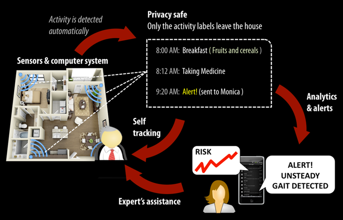

<!-- Page Content -->

  

    

      

        <h2 class="page-header-dark">About</h2>
        

            The Stanford People, AI, Robots Group (PAIR) is an interdisciplinary collaboration between
            the School of Medicine and the Computer Science department focusing on cutting edge
            computer vision and machine learning technologies to solve some of healthcare's most
            important problems.
        

        

            Our research routinely appears in popular press, international conference, and
            academic journal venues. We have a strong presence in the clinical, medical informatics,
            machine learning, and computer vision communities.
        

        

            We are actively looking for postdoctoral scholars, research fellows, and students in both clinical
            and machine learning domains. Let us work together to develop advanced artificial intelligence technologies for real-world healthcare settings.
        

      

        

        <h2 class="page-header-dark">Directors</h2>
        

            

                
                <h3><a href="http://vision.stanford.edu/feifeili/" target="_blank">Fei-Fei Li</a>
                    <small>Ph.D.</small>
                </h3>
                

                    Director, Stanford Artificial Intelligence Lab 
                    Associate Professor of Computer Science

            

            

                
                <h3><a href="https://med.stanford.edu/profiles/arnold-milstein" target="_blank">Arnold Milstein</a>
                    <small>M.D., M.P.H.</small>
                </h3>
                

                    Director, Clinical Excellence Research Center 
                    Professor of Medicine

            

        

        

    

  

  

    

      

        <h4 class="text-center press-mention">Press Mentions</h4>
      

      

        
        
        
        
        
        
      
​
    

  

  

    <!-- Portfolio Section -->
    

        

            <h2 class="page-header">Recent Projects</h2>
        

        

            
        

        

            
        

        

            
        

    

    <!-- /.row -->

    

    <!-- Call to Action Section -->
    

        

            

                
We are actively pursuing several clinical and artificial intelligence projects across the entire healthcare system.
                    We focus both on clinical outcomes, health improvements, and academic insights.

            

            

                <a class="btn btn-lg btn-default btn-block" href="projects/index.php">See our projects &nbsp;<i class="fa fa-caret-right" aria-hidden="true"></i></a>
            

        

    

    

        

<!-- /.container -->
