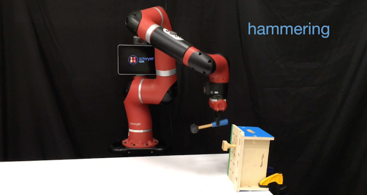

<!-- Page Content -->

  

    

      

        <h2 class="page-header-dark">About</h2>
        

            The Stanford People, AI, Robots Group (PAIR) is a research group under the <a href="http://svl.stanford.edu">Stanford Vision & Learning Lab</a> that focuses on solving the most important and challenging open problems at the intersection of computer vision, machine learning, and robotics.
        

        

            We develop novel computer vision and machine learning techniques to teach robots to perceive and to interact with the visual and physical world.
        

        

            We are actively seeking the best talents to join our group. Together we will push the envelope of the state-of-the-art of robot learning. Let's bring robots from highly structured laboratories to the unstructured real world!
        

      

      

          
      

    

  

  <!-- Portfolio Section -->
  

      

          <h2 class="page-header">News</h2>
          <ul class="news-list">
            <li>Two papers from PAIR are accepted at <a href="http://www.robot-learning.org/">CoRL 2018</a>.</li>
            <li>We have released <a href="publications">our new paper</a> on one-shot visual imitation with neural task graphs.</li>
          </ul>
      

  

  <!-- Portfolio Section -->
  

      

          <h2 class="page-header">Project Highlights</h2>
      

      

          
      

      

          
      

      

          
      

  

  <!-- /.row -->

  

  <!-- Call to Action Section -->
  <!-- 

      

          

              
We are actively pursuing several clinical and artificial intelligence projects across the entire healthcare system.
                  We focus both on clinical outcomes, health improvements, and academic insights.

          

          

              <a class="btn btn-lg btn-default btn-block" href="projects/index.php">See our projects &nbsp;<i class="fa fa-caret-right" aria-hidden="true"></i></a>
          

      

  
 -->

<!-- /.container -->
