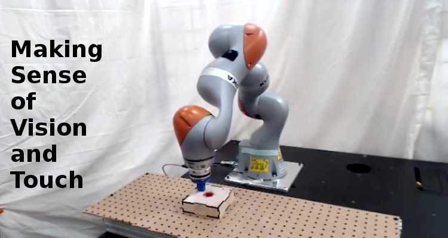
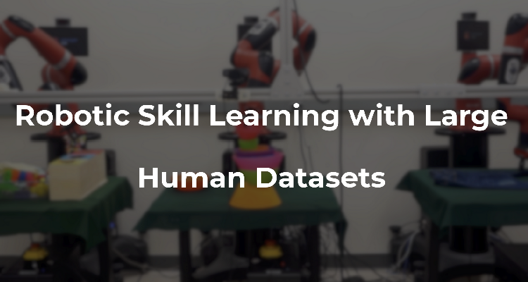
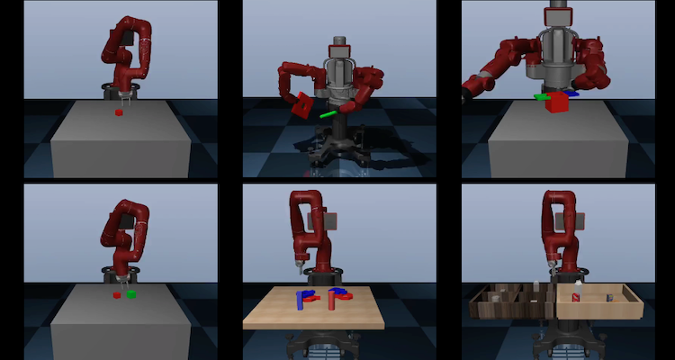

<!-- Page Content -->

  

    

      

        <h2 class="page-header-dark">About</h2>
        

            Stanford People, AI & Robots Group (PAIR) is a research group under the <a href="http://svl.stanford.edu">Stanford Vision & Learning Lab</a> that focuses on developing methods and mechanisms for generalizable robot perception and control.
        

        

            We work on challenging open problems at the intersection of computer vision, machine learning, and robotics. We develop algorithms and systems that unify in reinforcement learning, control theoretic modeling, and 2D/3D visual scene understanding to teach robots to perceive and to interact with the physical world.
        

        

            We are always looking out for talented members to join our group. Please see our current openings at the <a href="{{ site.url }}/join">Join Us</a> page.
        

      

      

          
      

    

  

  <!-- Portfolio Section -->
  

      

          <h2 class="page-header">News</h2>
          <ul class="news-list">
            <li>We released <a href="https://sites.google.com/view/visionandtouch">our new paper</a> on learning multimodal representations for robot manipulation.</li>
            <li>Two papers from PAIR are accepted at <a href="http://www.robot-learning.org/">CoRL 2018</a>.</li>
            <li>We have released <a href="publications">our new paper</a> on one-shot visual imitation with neural task graphs.</li>
          </ul>
      

  

  <!-- Portfolio Section -->
  

      

          <h2 class="page-header">Project Highlights</h2>
      

      

          
      

      

          
      

      

          
      

      

          
      

       
      

          
      

  

  <!-- /.row -->

  

  <!-- Call to Action Section -->
  <!-- 

      

          

              
We are actively pursuing several clinical and artificial intelligence projects across the entire healthcare system.
                  We focus both on clinical outcomes, health improvements, and academic insights.

          

          

              <a class="btn btn-lg btn-default btn-block" href="projects/index.php">See our projects &nbsp;<i class="fa fa-caret-right" aria-hidden="true"></i></a>
          

      

  
 -->

<!-- /.container -->
